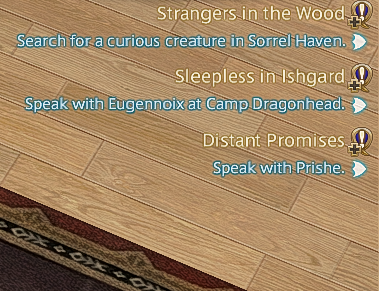
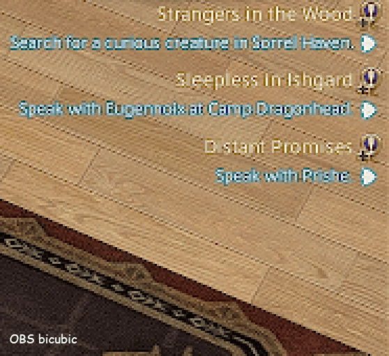
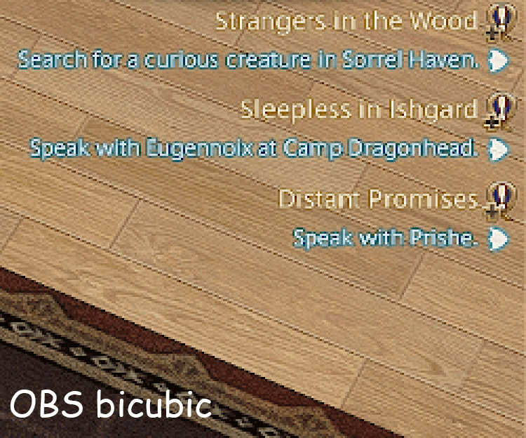
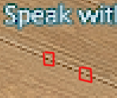
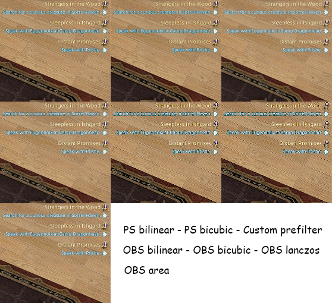

# OBS has never implemented downscaling filters correctly

Upscaling is fine. But not downscaling! The result is often very aliased and "crawly".

It's clear as day when you try to resize by yourself using Photoshop, for example, and compare what OBS outputs.

# My workaround

A shader effect that "prefilters" the image to replicate what the result should be if the resize was a Catmull-Rom 50% downscale. **This works only for a 50% downscale, e.g. 4K to 1080p, because that's my use case.** (It shouldn't look "too wrong" for downscales that are close enough, but still.) It accounts for the unavoidable 2x2 box filter that OBS does when using the bilinear filter mode — so this is what your "Downscale Filter" must be set to.

This can be applied to any source (or a group of sources) using [obs-shaderfilter](https://github.com/exeldro/obs-shaderfilter).

[You can download the shader file here.
](https://github.com/MaxLebled/obs-resize-prefilter/blob/main/downscale_prefilter_50_percent.shader) 

# Comparisons

**Comparison GIF with a 2:1 ratio (3840x2160 → 1920x1080),** upscaled back up with nearest-neighbor for your pixel-peeping convenience

**Comparison GIF with a 1,5:1 ratio (3840x2160 → 2560x1440),**

Note the line discontinuities that show up in this case: 

 

**Comparing all methods with a 2:1 ratio (3840x2160 → 1920x1080)** - you may wish to right click, open image in new tab.

 

# Video comparisons

**Left: OBS ☹️**
**Right: this workaround 🙂**

The videos were shot at 1:1 pixel scale, recorded with OBS using lossless recording mode, and encoded with Handbrake in SVT-AV1 10-bit mode at a very high quality level.

https://github.com/user-attachments/assets/7697c481-9f00-40d6-acd7-52977905621d

[Native resolution file here.](media/comparison_01.mp4)

Note the aliasing of the wooden planks and how the "Felyne Mender" text shifts in readability as it shifts by exactly one pixel in the source... and how this is mitigated with my workaround.

https://github.com/user-attachments/assets/c6577971-d522-4ea5-ad27-a26eb76e7dda

Try playing this back in fullscreen, and note how, on the left, the image is much more "crawly", how the wooden fence has more aliasing, how the word "Placard" jitters... and how this is solved on the right.

# Why is OBS doing this?

I dug into the OBS source code, and if I'm reading it correctly... the core reason is that the kernels are all fixed-width, which is fine for upscaling, but breaks down when downscaling.

**A 2:1 / 50% downscale (e.g. 4K to 1080p) is actually the worst case scenario,** because every downscaling filter ends up being the same as a 2x2 box filter. Worse: bicubic and lanczos then apply sharpening on top of _that_, making the aliased & crawly result even worse.

Every downscale filter except "Area" uses a fixed-size averaging window. When you're downscaling, the averaging window has to get bigger the more you shrink. OBS never does that. So Bicubic and Lanczos never actually remove the fine detail that can't fit in the smaller image, and that detail comes back aliased as hell.

Below a 50% ratio, OBS does... 8xMSAA style sampling. In the sense that it borrows MSAA's sample positions from DIrect3D, you know, that grid of points that's askew. That's in `libobs/data/bilinear_lowres_scale.effect`. In which case your choice of filter is completely discarded. That's in `libobs/obs-scene.c:766-767` and `libobs/obs-video.c:224-228`. Note that this kicks in _below_ 50%, not when _equal OR below_ 50%. So a 4K to 1080p downscale in OBS is truly the worst case scenario.

My understanding is that these 8 samples are mathematically fine until 33% (so, 4K to 720p), then it technically becomes worse again. But then again I don't think most people do more than a 3:1 downscale in OBS.

### Area

The "Area" downscale filter is the only one of the four that OBS provides which is correct, in the sense that its averaging window is the only one that actually scales with the ratio (resolution difference).

At a ratio of 4:3 (2560x1440 → 1920x1080) it's averaging 1.33 source pixels together for 1 output pixel, which is correct. Unfortunately... it's stil a plain box average, and a box filter is the weakest possible filter even when it's done properly.

# Contributing a fix to OBS

I'm not doing that, simply because I'm not able to.

It should be clear from the code comments that I struggled my way through writing this single fixed-size kernel as it is, and quite frankly I have no idea how to even begin writing one that changes its window size dynamically, optimising its taps, etc.

But you know, at least I've identified the issue and made a workaround for my use case... so I figured I might as well share it, seeing as this has been a problem in OBS for over a decade.
